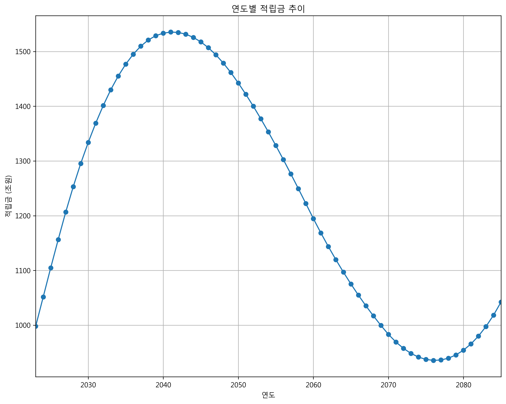
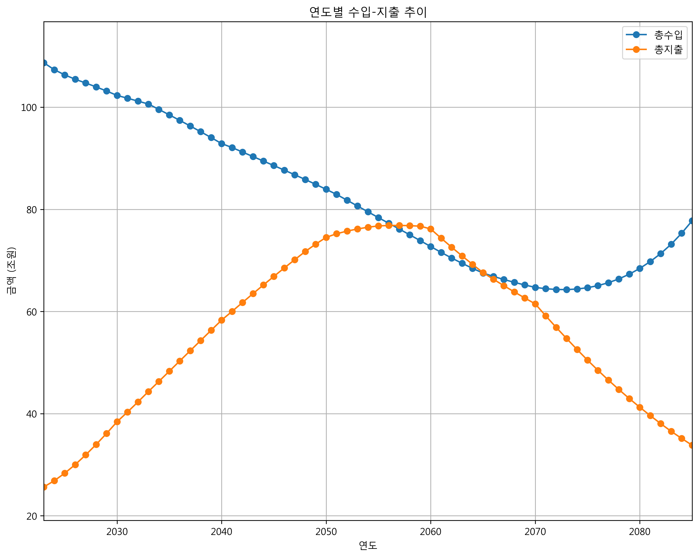
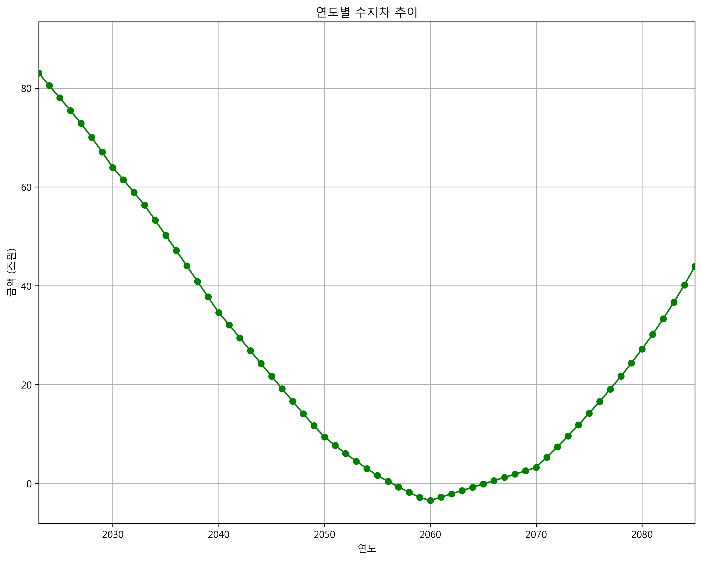
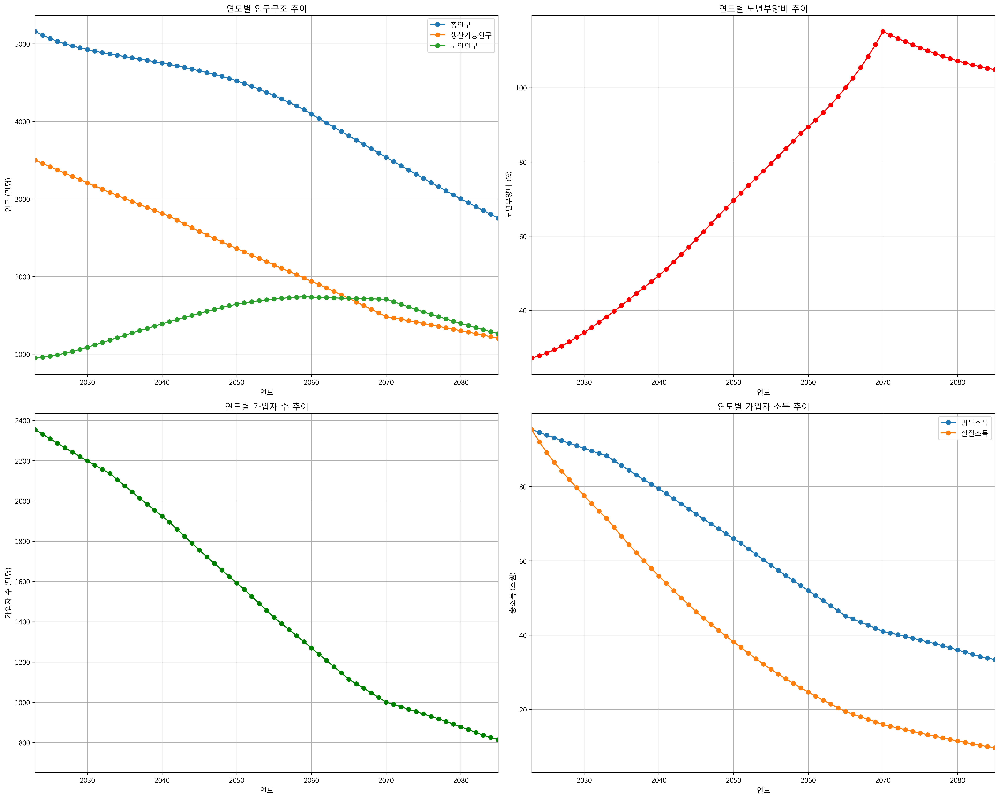

# 국민연금 재정추계 모델 


<div style="float: right; font-size: 0.8em; text-align: right;">
박정현<br>
jh70035@gmail.com<br>

</div>


## 프로젝트 소개 🚀

이 미니 프로젝트는 [국민연금 제5차 재정계산 결과 (2023)](https://nsp.nanet.go.kr/plan/subject/detail.do?nationalPlanControlNo=PLAN0000037347)를 기반으로 국민연금의 장기 재정추계를 수행하는 파이썬 기반 모델입니다. 

### 주요 특징
- **추계 기간**: 2023년 ~ 2093년 (70년)
- **기반 자료**: [국민연금 제5차 재정계산 결과 (2023)](https://nsp.nanet.go.kr/plan/subject/detail.do?nationalPlanControlNo=PLAN0000037347)

## 주요 기능
- 인구추계 (DemographicModule)
- 거시경제변수 추계 (EconomicModule)
- 가입자 추계 (SubscriberModule)
- 급여지출 추계 (BenefitModule)
- 재정수지 추계 (FinanceModule)


## 추계 결과
본 모델의 추계 결과는 제5차 재정계산 보고서의 정보를 기반으로 하였습니다.

### 주요 결과
- 국민연금 적립금은 2040년대 초반에 약 1,535조 원으로 최고치에 도달한 후 지속적으로 감소
- 수입보다 지출이 더 커지는 수지적자는 2057년부터 발생할 것으로 예측되었습니다. 
- 5차 재정계산 보고서에 명시된 인구 및 경제지표 외 독자적 가정을 적용하면서  결과의 차이가 발생한 것으로 보입니다. 

### 주요 결과 그래프

#### 1. 연도별 적립금 추이

- 기금은 2041년에 최대 적립금 1,535조 원 도달
- 이후 지속적인 감소 추세
- 2057년 기금 적자전환

#### 2. 연도별 수입-지출 현황



#### 3. 연도별 수지차 분석

- 2057년 최초 적자 전환
- 수지차 = 총수입 - 총지출

#### 4. 인구구조 변화

- 총인구 및 생산가능인구 감소 추세
- 노년부양비 지속적 증가
- 저출산 고령화의 영향 반영


## 주요 매개변수
### 인구 변수
- 합계출산율: 2023년 0.73명 → 2050년 1.21명
- 기대수명: 2023년 84.3세 → 2070년 91.2세
- 국제순이동: 연간 4-5만명 수준

### 경제 변수
- GDP 성장률: 2023년 2.2% → 2060년 0.7%
- 임금상승률: 2023년 2.3% → 2060년 1.5%
- 물가상승률: 2023년 3.3% → 2027년 이후 2.0%

### 연금 변수
- 보험료율: 9%
- 소득대체율: 40%
- 수급개시연령: 65세

## 참고문헌
- 국민연금 제5차 재정계산 결과 (2023)
https://nsp.nanet.go.kr/plan/subject/detail.do?nationalPlanControlNo=PLAN0000037347


## 향후 개선 계획 📈

### 단기 개선사항
- 최근 금리 상승을 반영한 재정추계 재계산
  - 국제 경제상황 변동 반영
  - 금리 민감도 분석

### 중장기 개선사항
- 모델 정확도 검증
  - 백테스팅 수행
  - 과거 데이터와의 비교 분석
- 주요 변수별 민감도 분석 실시


## 추계 실행
```python .\NPS_model.py```


## 출력 결과
모델은 두 가지 CSV 파일을 생성합니다:
- `financial_results_실질_[timestamp].csv`: 재정추계 결과
- `demographic_results_실질_[timestamp].csv`: 인구추계 결과