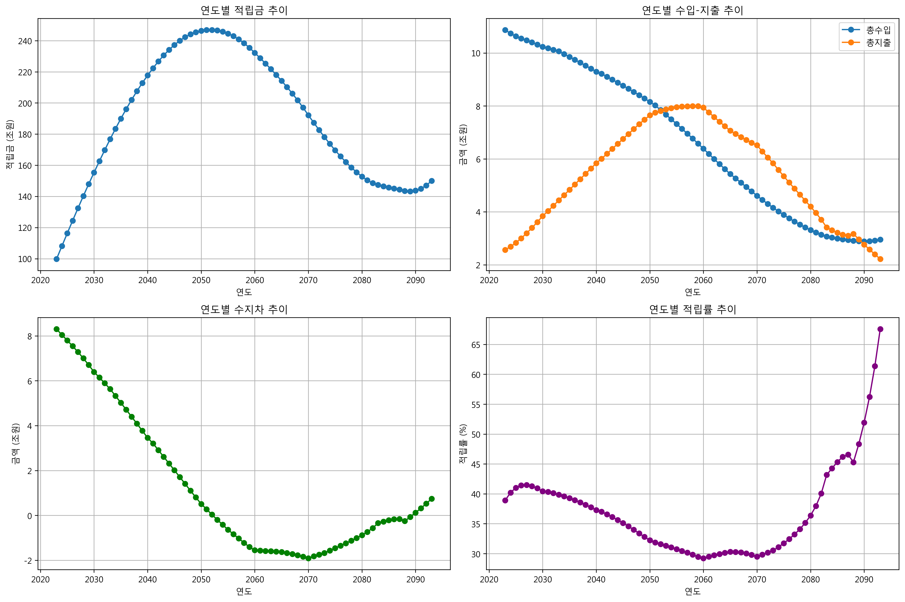
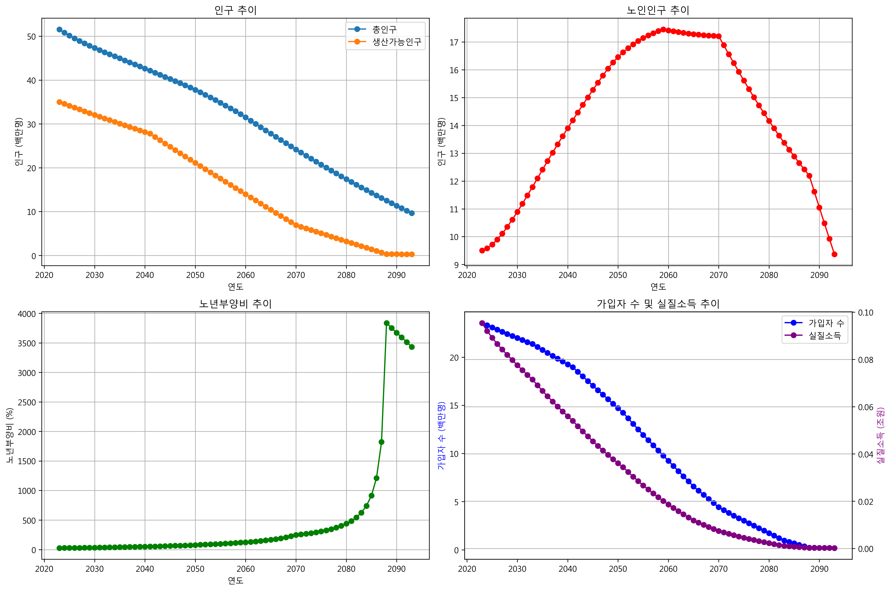

# 국민연금 재정추계 모델 


<div style="float: right; font-size: 0.8em; text-align: right;">
박정현<br>
jh70035@gmail.com<br>

</div>


## 프로젝트 소개
이 미니 프로젝트는 국민연금의 장기 재정추계를 수행하는 파이썬 기반 모델입니다. 2023년부터 2093년까지의 국민연금 재정상태를 예측합니다.

본 모델은 다음 자료를 참고하여 작성되었습니다:
- [국민연금 제5차 재정계산 결과 (2023)](https://nsp.nanet.go.kr/plan/subject/detail.do?nationalPlanControlNo=PLAN0000037347)


## 주요 기능
- 인구추계 (DemographicModule)
- 거시경제변수 추계 (EconomicModule)
- 가입자 추계 (SubscriberModule)
- 급여지출 추계 (BenefitModule)
- 재정수지 추계 (FinanceModule)


## 추계 결과
본 모델의 추계 결과는 제5차 재정계산 보고서의 정보를 기반으로 하였습니다.

### 주요 결과
- 적립금은 2050년대 초반 최고치 도달 후 감소
- 수지적자는 2050년대 초반부터 발생

### 시각화 결과

*재정추계 결과 그래프*


*인구추계 결과 그래프*


## 주요 매개변수
### 인구 변수
- 합계출산율: 2023년 0.73명 → 2050년 1.21명
- 기대수명: 2023년 84.3세 → 2070년 91.2세
- 국제순이동: 연간 4-5만명 수준

### 경제 변수
- GDP 성장률: 2023년 2.2% → 2060년 0.7%
- 임금상승률: 2023년 2.3% → 2060년 1.5%
- 물가상승률: 2023년 3.3% → 2027년 이후 2.0%

### 연금 변수
- 보험료율: 9%
- 소득대체율: 40%
- 수급개시연령: 65세

## 참고문헌
- 국민연금 제5차 재정계산 결과 (2023)
https://nsp.nanet.go.kr/plan/subject/detail.do?nationalPlanControlNo=PLAN0000037347


## 추계 실행
```python .\NPS_model.py```


## 출력 결과
모델은 두 가지 CSV 파일을 생성합니다:
- `financial_results_실질_[timestamp].csv`: 재정추계 결과
- `demographic_results_실질_[timestamp].csv`: 인구추계 결과